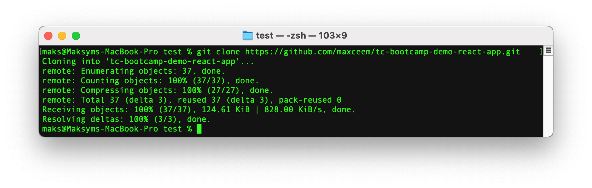
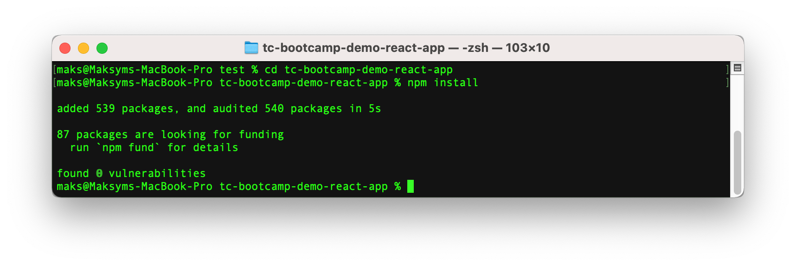
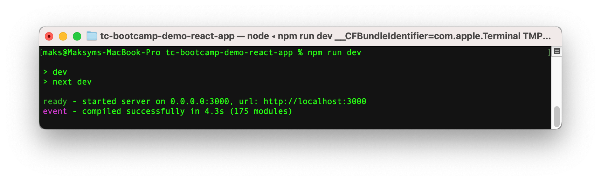
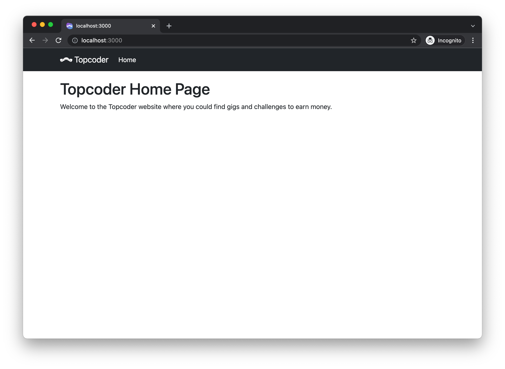

# Topcoder Virtual Bootcamp - React Demo Application

## Getting Started

### System Requirements

- Make sure you have [Node.js](https://nodejs.org/en/) 10.13 or later.
- [Git](https://git-scm.com/) command line tool or [Git GUI client](https://git-scm.com/downloads/guis/) like [Sourcetree](https://www.sourcetreeapp.com/).

### How to run locally

1. Clone this git repository.

  Open terminal/console window and navigate to some folder where you would like to store this project and run command:

  ```bash
  git clone https://github.com/maxceem/tc-bootcamp-demo-react-app.git
  ```

  <details><summary>Click to see example output</summary>
  <br>
  
  </details>

2. Install NPM dependencies.

  Navigate to the project root folder in the terminal (folder `tc-bootcamp-demo-react-app`) and run command:

  ```bash
  # navigate to the root project folder
  cd tc-bootcamp-demo-react-app

  # install dependencies
  npm install
  ```

  <details><summary>Click to see example output</summary>
  <br>
  
  </details>

3. Run the development server (inside the same folder `tc-bootcamp-demo-react-app`):

  ```bash
  npm run dev
  ```

  <details><summary>Click to see example output</summary>
  <br>
  
  </details>

4. Open [http://localhost:3000](http://localhost:3000) with your browser to see the result.

  <details><summary>Click to see how website would look like</summary>
  <br>
  
  </details>

## Commands

To check code for lint errors run the next command:

```bash
npm run lint
```

## Technology Stack

- [React 17](https://reactjs.org/)
- This is a [Next.js](https://nextjs.org/) project bootstrapped with [`create-next-app`](https://github.com/vercel/next.js/tree/canary/packages/create-next-app).
- [React Bootstrap](https://react-bootstrap.github.io/) - for styling and reusable components.

## Recommended Documentation

- If you would like to learn React from scratch there is no better place then [official React documentation](https://reactjs.org/docs/getting-started.html).
- This project was built using [Next.js](https://nextjs.org/) - which is a React framework. It configures a lot of things which you usually need when creating a production website like routing, SSR (server side rendering) and so on. It hides from you some low-level concepts of React, but it allowes you to start building production websites using React faster. It has a [great documentation to learn it](https://nextjs.org/docs/getting-started).
